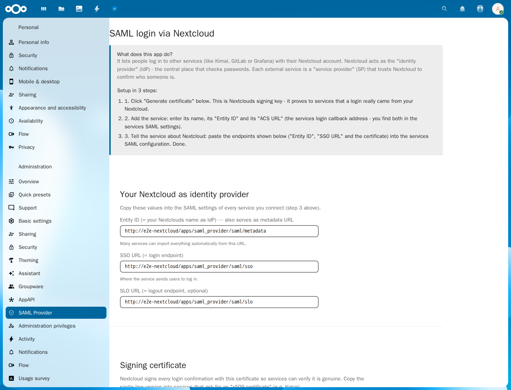
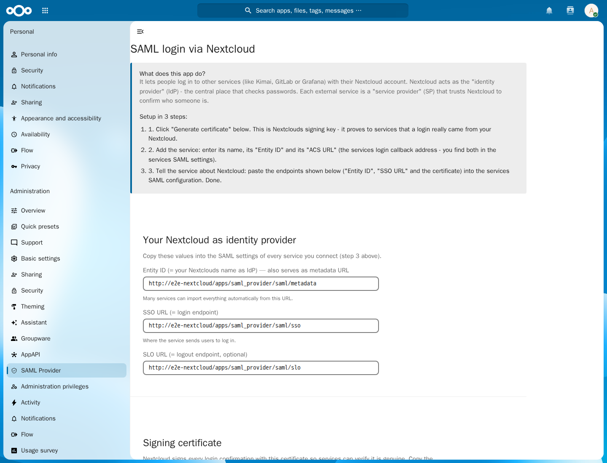

# SAML Provider for Nextcloud

[](https://github.com/derStephan/nextcloud-SAML-provider/actions/workflows/tests.yml)
[](https://github.com/derStephan/nextcloud-SAML-provider/actions/workflows/nextcloud-integration.yml)
[](https://github.com/derStephan/nextcloud-SAML-provider/actions/workflows/kimai-saml-e2e.yml)
[](https://github.com/derStephan/nextcloud-SAML-provider/releases)
[](LICENSE)

<!-- NEXTCLOUD_COMPATIBILITY:START -->
**Tested Nextcloud compatibility:** maintained Nextcloud major releases plus the newest available RC/Beta
<!-- NEXTCLOUD_COMPATIBILITY:END -->

<!-- PHP_COMPATIBILITY:START -->
**Tested PHP compatibility:** maintained PHP 8.2+ releases
<!-- PHP_COMPATIBILITY:END -->

Use Nextcloud as a **SAML 2.0 Identity Provider**. People sign in to connected services with their existing Nextcloud account; administrators manage those services in one place.

## What it does

- Signs SAML Responses and Assertions with RSA-SHA256.
- Supports service-provider initiated sign-in and a user-facing launcher.
- Provides IdP metadata for straightforward onboarding.
- Lets administrators configure a Service Provider’s Entity ID, ACS URL, NameID format, attributes, certificate, and request-signing policy.
- Includes a real browser end-to-end test against Kimai.

> **Before production use:** test every connected service with a normal user account before disabling another login method. This app implements SAML Web Browser SSO; it does not expose Single Logout.

## Install and connect a service

1. Place the `saml_provider` app directory in a configured Nextcloud app directory, commonly `custom_apps/`.
2. Enable it:

   ```bash
   sudo -u www-data php occ app:enable saml_provider
   ```

3. Open **Administration settings → SAML Provider**.
4. Choose **Generate certificate**. Keep the private key in Nextcloud; share only the public certificate.
5. Add a connected service with its name, Entity ID, and ACS URL.
6. Import the metadata URL in the connected service, or enter the IdP data manually.
7. Start a login from the connected service and confirm the returned user identity.

### IdP endpoints

Replace `cloud.example.com` with the public Nextcloud host.

| Purpose | URL |
| --- | --- |
| Metadata | `https://cloud.example.com/apps/saml_provider/saml/metadata` |
| SSO | `https://cloud.example.com/apps/saml_provider/saml/sso` |
| User launcher | `https://cloud.example.com/apps/saml_provider/` |
| IdP-initiated login | `https://cloud.example.com/apps/saml_provider/saml/login/{service-provider-id}` |

## What administrators see

These screenshots are captured by the Kimai browser end-to-end workflow after it creates a certificate and registers a service through the normal Nextcloud administration interface.

| Nextcloud 33 | Nextcloud 34 |
| --- | --- |
|  |  |

## Kimai: complete administrator setup

This example connects **Kimai** at `https://kimai.example.com` to **Nextcloud** at `https://cloud.example.com`. Complete the Nextcloud steps first, then configure Kimai. Keep a local Kimai administrator account until you have tested SAML login with a normal user.

### 1. Configure the connected service in Nextcloud

Open **Administration settings → SAML Provider** and generate the signing certificate if you have not done so.

Under **Connect a new service**, enter:

| Nextcloud field | Value for Kimai |
| --- | --- |
| Name | `Kimai` |
| Entity ID | `https://kimai.example.com/auth/saml/metadata` |
| ACS URL | `https://kimai.example.com/auth/saml/acs` |

After creating the service, open **Show/edit details for “Kimai”** and set **How the user is identified (NameID)** to **Nextcloud username** (`urn:oasis:names:tc:SAML:2.0:nameid-format:unspecified`). Kimai requests this NameID format in its metadata.

Copy these values from the Nextcloud SAML Provider page:

| Kimai setting | Nextcloud value |
| --- | --- |
| IdP Entity ID | `https://cloud.example.com/apps/saml_provider/saml/metadata` |
| IdP SSO URL | `https://cloud.example.com/apps/saml_provider/saml/sso` |
| IdP certificate | **Certificate (single line – for services like Kimai)** |

The app sends `uid`, `displayName`, and `mail` when those user-profile values are available. Kimai requires an email mapping, so ensure every user who should use Kimai has an email address in Nextcloud.

### 2. Configure Kimai

Create or update `config/packages/local.yaml` on the Kimai server. Replace all example hosts and the certificate value. The certificate must be one base64 line without `BEGIN CERTIFICATE` / `END CERTIFICATE` markers or line breaks.

```yaml
kimai:
  saml:
    provider: nextcloud
    activate: true
    title: Sign in with Nextcloud
    mapping:
      - { saml: $mail, kimai: email }
      - { saml: $displayName, kimai: alias }
    connection:
      idp:
        entityId: 'https://cloud.example.com/apps/saml_provider/saml/metadata'
        singleSignOnService:
          url: 'https://cloud.example.com/apps/saml_provider/saml/sso'
          binding: 'urn:oasis:names:tc:SAML:2.0:bindings:HTTP-Redirect'
        x509cert: 'PASTE_THE_SINGLE_LINE_NEXTCLOUD_CERTIFICATE_HERE'
      sp:
        entityId: 'https://kimai.example.com/auth/saml/metadata'
        assertionConsumerService:
          url: 'https://kimai.example.com/auth/saml/acs'
          binding: 'urn:oasis:names:tc:SAML:2.0:bindings:HTTP-POST'
        singleLogoutService:
          url: 'https://kimai.example.com/auth/saml/logout'
          binding: 'urn:oasis:names:tc:SAML:2.0:bindings:HTTP-Redirect'
      baseurl: 'https://kimai.example.com/auth/saml/'
      strict: true
      security:
        authnRequestsSigned: false
        wantAssertionsSigned: false
        wantMessagesSigned: false
```

Reload Kimai’s production cache after changing `local.yaml` (for example `bin/console cache:clear --env=prod` in the Kimai container or installation). If Kimai runs behind a reverse proxy, configure its trusted proxies and forward the original HTTPS protocol, host, and port; otherwise the ACS URL can be detected incorrectly.

### 3. Test safely

1. Open `https://kimai.example.com/auth/saml/metadata` and confirm that Kimai exposes its metadata.
2. Start at `https://kimai.example.com/auth/saml/login`.
3. Sign in with a non-administrator Nextcloud user that has an email address.
4. Confirm that Kimai opens an authenticated session.
5. Only after this succeeds, consider changing Kimai’s local-login policy.

For additional Kimai-specific deployment guidance, see the [Kimai SAML documentation](https://www.kimai.org/documentation/saml.html).

## Languages

The user interface is shipped in these ten broadly used Nextcloud languages: **English** (`en`), **German** (`de`, including `de_DE`), **French** (`fr`), **Spanish** (`es`), **Italian** (`it`), **Portuguese — Brazil** (`pt_BR`), **Polish** (`pl`), **Russian** (`ru`), **Japanese** (`ja`), and **Chinese — Simplified** (`zh_CN`). Nextcloud documents all of these locale families in its own multilingual user documentation. The selection is an intentionally practical coverage set; Nextcloud does not publish a global, comparable language-usage ranking for all self-hosted instances.

The application keeps JSON, JavaScript, and PHP catalogs in lockstep. Some explanatory copy is deliberately concise in the additional languages; SAML names, protocol tokens, URLs, and certificate identifiers remain unchanged because they are configuration values, not prose.

## Test evidence artifacts

Each Kimai E2E target produces a traceable evidence bundle:

- browser traces for the negative, signed-positive, and tampered-response sessions;
- terminal-state screenshots and bounded HTML captures, including any Kimai onboarding steps;
- the persisted Nextcloud-to-Kimai IdP configuration and E2E context;
- Nextcloud IdP metadata, Kimai login headers, and NameID-policy request/response captures;
- a populated Nextcloud SAML administration screenshot after success; and
- on failure, the container list and complete Nextcloud, Kimai, and MariaDB logs.

Artifact names include the Nextcloud target and CI run. Browser/protocol evidence is retained for every run; diagnostics are added when a run fails.

## Security essentials

- Use HTTPS for Nextcloud and every connected service.
- Keep server clocks synchronized. AuthnRequests may be at most five minutes old.
- Enable **Require signed AuthnRequests** only after adding the Service Provider’s signing certificate.
- Persistent NameIDs are installation-specific HMAC values; they are stable per user and service without exposing a predictable hash of the user ID.
- HTTP-Redirect AuthnRequests are limited to 1 MiB after decoding and decompression.
- Redirect signatures use the original query string as required by SAML. Reverse proxies must preserve it unchanged.

## Automated compatibility releases

A scheduled compatibility check discovers maintained PHP and Nextcloud versions. A regular push still runs the normal test chain, but **only scheduled runs** can automatically publish a release.

1. The scheduled Unit workflow discovers maintained PHP 8.2+ releases and enforces the 80% production-coverage gate.
2. The integration workflow discovers maintained Nextcloud majors plus the newest Apache RC/Beta and runs each target with SQLite, MariaDB, and PostgreSQL.
3. Kimai E2E runs the full real-browser SAML journey for every discovered Nextcloud target and captures one populated administration screenshot per successful target.
4. After every scheduled, completely green chain, the release workflow compares the freshly tested maintained Nextcloud range with the recorded compatibility marker.
5. Only if the compatibility range changed, it updates the README and App Store description, increments the patch version, signs the runtime-only archive, tags it, and creates the GitHub/App Store release.

The release archive contains only runtime app files. It never contains test code, CI configuration, build directories, signing keys, or placeholder signatures.

## Support and scope

- **Languages:** English and German are maintained. Nextcloud falls back to English for other languages.
- **Development dependencies:** Composer audit is enabled. A reviewed `composer.lock` should be committed when generated in a Composer-capable environment.
- **Issue reports:** include the Nextcloud version, app version, browser/service-provider details, and relevant non-sensitive logs.

## License

[MIT](LICENSE)
